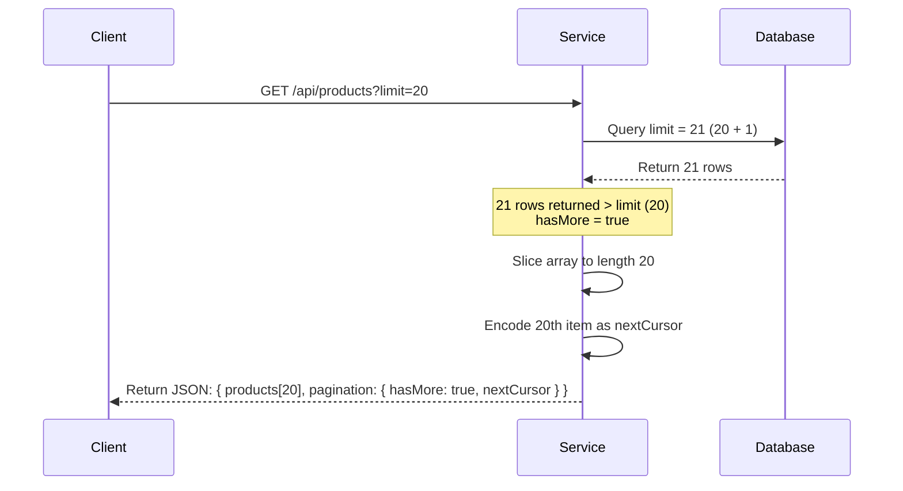

# Product Browser – Cursor Pagination Backend Assignment

A high-performance, cursor-paginated product catalog built to scale. This project demonstrates constant-time queries on a dataset of 200,000+ products using composite indexing. It features a robust, validation-enforced Express API layer coupled with a polished React frontend dashboard.

This project demonstrates:
* **Cursor-Based Pagination** for stable, constant-time database navigation ($O(1)$ scaling relative to pagination depth).
* **Dynamic Category Filtering** mapped directly to composite B-Tree indexes.
* **PostgreSQL Database** utilizing custom schemas, CHECK constraints, and index scans.
* **Node.js, Express, and TypeScript** backend structured with layered software design.
* **Zod Schema Parsing** for request validation and type coercion.
* **React Dashboard UI** built with Vite and TypeScript (including static skeleton loading state).

---

## Live Demo

* **Frontend Dashboard**: [https://codevector-assignment-1-frontend.onrender.com](https://codevector-assignment-1-frontend.onrender.com)
* **Backend API Endpoint**: [https://codevector-assignment-1-backend.onrender.com/api/products](https://codevector-assignment-1-backend.onrender.com/api/products)

---

## GitHub Repository

* **Workspace URL**: [https://github.com/Mayank9370/codeVector-Assignment-](https://github.com/Mayank9370/codeVector-Assignment-)

---

## Features

* **Browse 200,000+ Products**: Seamlessly queries and presents high-volume datasets.
* **Opaque Cursor-Based Pagination**: Employs URL-safe Base64url pagination tokens to seek offsets.
* **Category Filtering**: Optimized filtering for specific product classifications.
* **Stable Ordering**: Multi-column sorting using `(created_at, id)` descending prevents item duplicates or slips.
* **No Database filesorts**: Database reads are fully covered by composite B-Tree indexes.
* **Fast Database Seeder**: Generates and inserts 200,000 records in under 10 seconds via transactions and multi-row batches.
* **Fail-Fast Environment validation**: Evaluates and asserts required env variables on start.
* **Layered Software Architecture**: Strict decoupling of HTTP parsing, business logic, and database operations.

---

## Tech Stack

### Backend
* **Runtime**: Node.js (v18+)
* **Framework**: Express.js
* **Language**: TypeScript
* **Database**: PostgreSQL (hosted via Supabase)
* **Validation**: Zod

### Frontend (React Demo UI)
* **Framework**: React (v18)
* **Build System**: Vite
* **Language**: TypeScript
* **Styling**: Vanilla CSS (Slate/Indigo dashboard system)

---

## Project Structure

```text
project/
├── client/                     # Frontend client React application
│   ├── src/
│   │   ├── components/         # Presentational and UI components (FilterBar, ProductCard, Pagination)
│   │   ├── hooks/              # Custom React hooks (useProducts state controller)
│   │   ├── services/           # API endpoints fetch client layer
│   │   ├── config/             # Environment validation config layer (env.ts)
│   │   ├── styles/             # CSS styling declarations (App.css)
│   │   └── types/              # Frontend TypeScript interface models
│   ├── tsconfig.json           # Client TypeScript configuration (Vite type bindings)
│   └── package.json
├── server/                     # Backend API Node/Express application
│   ├── src/
│   │   ├── config/             # Config loader, DB Pool wrapper (database.ts, environment.ts)
│   │   ├── database/           # Schema creation SQL, seeder script, and schema runners
│   │   ├── middleware/         # Error handler, Request logger, Zod query validator
│   │   ├── modules/            # Feature domains (products/, health/)
│   │   │   ├── products/       # Product router, controller, service, repository, and validators
│   │   │   └── health/         # System status health monitor routes
│   │   ├── utils/              # Base64url cursor serialization, custom AppError classes
│   │   ├── app.ts              # Express application factory
│   │   └── server.ts           # Infrastructure bootstrapper and listener
│   ├── tsconfig.json           # Server compiler instructions
│   └── package.json
├── docs/                       # Architecture documents
└── README.md                   # This project overview manual
```

---

## Layered Architecture

The application adheres to a clean **Layered Architecture** pattern, isolating HTTP transport logic from core business logic and database queries.

```text
Client (React)
    ↓
Express Router
    ↓
Validation Middleware (Zod)
    ↓
Controller (Express Request/Response mapping)
    ↓
Service Layer (Business rules, Cursor logic, Pagination arithmetic)
    ↓
Repository Layer (Parameterized SQL builders)
    ↓
PostgreSQL Database
```

### Responsibility of Every Layer
1. **Client (React)**: Captures user clicks (category changes, page changes) and displays state. Caches pagination cursor history inside `pageCursorsRef`.
2. **Express Router**: Maps URLs (e.g. `GET /api/products`) to the correct controller endpoint pipelines.
3. **Validation Middleware**: Parses raw query parameter strings, applies defaults (like `limit=20`), coerses types, and forwards violations to the central error handler.
4. **Controller**: Intercepts request properties, calls the service layer, and writes standardized HTTP JSON envelopes.
5. **Service**: Encapsulates cursor validation, decodes Base64 tokens, modifies limits to query `limit + 1` rows to determine page availability, and encodes coordinates for `nextCursor`.
6. **Repository**: Directs interactions with the PostgreSQL pool. Constructs parameterized SQL queries to prevent SQL injections.
7. **PostgreSQL**: Stores records and scans indices to execute queries in constant time.

---

## Cursor Pagination

### Why Cursor Pagination?
Traditional offset-based pagination (`LIMIT 20 OFFSET 100000`) becomes a bottleneck for large tables because database engines must scan and discard all rows prior to the target offset. This results in $O(N)$ linear degradation of query latency.

Cursor-based pagination utilizes value-based seeks (`WHERE (created_at, id) < (cursor_timestamp, cursor_uuid)`). It leverages the pre-sorted composite B-Tree index to perform a binary search tree seek directly to the cursor position ($O(\log N)$) and read the subsequent slice, resulting in constant-time latency.

```text
OFFSET Pagination:  [Scan N rows (Discard)] ──> [Return K rows]  --> O(N) Complexity
Cursor Pagination:  [Index Seek directly to cursor] ──> [Return K rows] --> O(log N + K) Complexity
```

Additionally, cursor pagination prevents:
* **Skipped records**: If a product is deleted from page 1 while a user is reading page 2, the offset would shift, skipping a product. Cursors anchor pagination to specific values, avoiding page shifting.
* **Duplicate records**: If a product is added to the start of the list, an offset query would display the last item of page 1 again as the first item of page 2.

### Tuple Comparison
Because products can be created during the exact same millisecond, sorting by `created_at` timestamp alone is not deterministic and would cause page boundary gaps or duplicates. We employ `id` (primary key UUID) as a tie-breaker, sorting by `created_at DESC, id DESC`.

The database queries values using row constructors (tuple comparisons):
```sql
WHERE (created_at, id) < (cursor_created_at, cursor_id)
```
This is logically equivalent to:
`created_at < cursor_created_at OR (created_at = cursor_created_at AND id < cursor_id)`

This range condition matches our descending index exactly, letting PostgreSQL seek to the item and scan downwards.

### Page Boundaries (Limit + 1)
To determine whether a next page exists without running an expensive `COUNT(*)` query over 200,000 rows, we use the **Limit + 1 Trick**:



* If the database returns fewer than 21 rows (e.g. 15), `hasMore` is set to `false`, and `nextCursor` is returned as `null`.

---

## Database Schema & Indexes

### Schema
```sql
CREATE TABLE IF NOT EXISTS products (
    id          UUID PRIMARY KEY DEFAULT gen_random_uuid(),
    name        VARCHAR(255) NOT NULL,
    category    VARCHAR(100) NOT NULL,
    price       NUMERIC(10, 2) NOT NULL CHECK (price >= 0),
    created_at  TIMESTAMPTZ NOT NULL DEFAULT NOW(),
    updated_at  TIMESTAMPTZ NOT NULL DEFAULT NOW()
);
```

### Custom Indexes
1. **Unfiltered Index (`idx_products_created_at_id`)**:
   ```sql
   CREATE INDEX idx_products_created_at_id ON products (created_at DESC, id DESC);
   ```
   Powers default catalog requests. Matches the sort order of the query `ORDER BY created_at DESC, id DESC` to read pre-sorted leaf nodes without a `filesort` operation.
   
2. **Category Filter Index (`idx_products_category_created_at_id`)**:
   ```sql
   CREATE INDEX idx_products_category_created_at_id ON products (category, created_at DESC, id DESC);
   ```
   Powers requests filtered by category. The `category` column is placed first to filter the rows, allowing a range scan on the sorted `(created_at, id)` values within that category.

---

## API Documentation

### GET `/api/products`

Retrieves a paginated list of products.

#### Query Parameters
* **`cursor`** *(string, optional)*: Opaque Base64url token from a previous response. If omitted, retrieves page 1.
* **`limit`** *(integer, optional, default: 20)*: Page size (allowed values: 1 to 100).
* **`category`** *(string, optional)*: Filter for a specific category (e.g., `'electronics'`).

#### Example Request
```bash
GET /api/products?category=electronics&limit=5
```

#### Example Response (`200 OK`)
```json
{
  "success": true,
  "data": {
    "products": [
      {
        "id": "2d8f99e4-aa94-4d89-b1ff-921a28a3f811",
        "name": "Sleek Keyboard 4192",
        "category": "electronics",
        "price": "145.50",
        "created_at": "2026-06-27T10:00:00.000Z",
        "updated_at": "2026-06-27T10:00:00.000Z"
      },
      {
        "id": "e0bfa9da-412d-42da-89ff-29bf8915b81a",
        "name": "Premium Mouse 8812",
        "category": "electronics",
        "price": "89.99",
        "created_at": "2026-06-27T09:45:00.000Z",
        "updated_at": "2026-06-27T09:45:00.000Z"
      }
    ],
    "pagination": {
      "nextCursor": "eyJjcmVhdGVkX2F0IjoiMjAyNi0wNi0yN1QwOTo0NTowMC4wMDBaIiwiaWQiOiJlMGJmYTlkYS00MTJkLTQyZGEtODlmZi0yOWJmODkxNWI4MWEifQ",
      "hasMore": true,
      "limit": 5
    }
  }
}
```

---

## Running Locally

### Requirements
* **Node.js**: version 18.0.0 or higher
* **PostgreSQL**: Local database or a remote instance (e.g. Supabase)

### Backend Setup
1. Navigate to the server folder:
   ```bash
   cd server
   ```
2. Install packages:
   ```bash
   npm install
   ```
3. Copy variables template:
   ```bash
   cp .env.example .env
   ```
   *Edit `.env` and configure your `DATABASE_URL`.*
4. Initialize the schema:
   ```bash
   npm run db:schema
   ```
5. Seed the database with 200,000 products:
   ```bash
   npm run db:seed
   ```
6. Start dev environment:
   ```bash
   npm run dev
   ```

### Frontend Setup
1. Navigate to the client folder:
   ```bash
   cd ../client
   ```
2. Install packages:
   ```bash
   npm install
   ```
3. Copy variables template:
   ```bash
   cp .env.example .env
   ```
   *Ensure `VITE_API_BASE_URL` is set to `http://localhost:3000/api`.*
4. Start dev server:
   ```bash
   npm run dev
   ```

---

## Environment Variables

### Backend (`server/.env`)
* **`PORT`** *(default: 3000)*: Port the backend server listens on.
* **`NODE_ENV`**: Application runtime environment (`development`, `production`, or `test`).
* **`DATABASE_URL`**: PostgreSQL connection string.
* **`CORS_ORIGIN`** *(default: http://localhost:5173)*: Target origin client permitted to call endpoints.

### Frontend (`client/.env`)
* **`VITE_API_BASE_URL`** *(default: http://localhost:3000/api)*: Base endpoint URL pointing to the API.

---

## Seeding Details

Database schema setup and seeding scripts run through specialized commands:
* **`npm run db:schema`**: Runs SQL schema scripts to create tables and composite indexes.
* **`npm run db:seed`**: Programmatic database seeder. Features batch writing (inserts 1,000 records per query) inside a single SQL transaction block (`BEGIN` / `COMMIT`). Inserts 200,000 rows in less than 10 seconds. Staggers creation timestamps over 30 days and duplicates timestamps for groups of 5 records to test page boundaries.

---

## Screenshots

Below are placeholders to showcase the minimal admin dashboard UI:

### Home Page
*(Placeholder for Home Page UI)*

### Category Filter
*(Placeholder for Category Filtering toolbar)*

### Pagination
*(Placeholder for Compact Pagination buttons)*

---

## Design Trade-Offs

### 1. Database Choice: PostgreSQL
* *Trade-off*: NoSQL databases (like MongoDB) are easier to configure, but PostgreSQL's B-Tree indexing is much more efficient for range scans and tuple seeks. High-precision decimal options like `NUMERIC` also protect transaction math from floating-point errors.

### 2. Seek (Cursor) vs. OFFSET Pagination
* *Trade-off*: OFFSET is easier to write (`LIMIT 20 OFFSET 100`) and supports jumping to arbitrary page indexes. However, it degrades in performance as page depth increases. Cursor pagination has a constant latency ($O(\log N)$) but does not support arbitrary jumps. The cursor must be cached in memory (frontend `pageCursorsRef`), and paged navigation is sequential.

### 3. Timestamp + UUID Sort Key
* *Trade-off*: Using a unique `created_at` timestamp is fast, but timestamps can overlap. Combining `created_at` with the primary key `id` guarantees unique values, preventing data gaps or duplicates on page boundaries.

### 4. Repository Pattern
* *Trade-off*: Writing raw SQL inside database repository layers is more complex than using an ORM like Prisma or Sequelize. However, ORMs can struggle to optimize row constructor queries like `(created_at, id) < ($1, $2)` and often fall back to slower query formats. Writing parameterized queries directly in repositories provides optimal control over the SQL execution plan.

---

## Future Improvements

* **Unit & Integration Testing**: Set up Mocha/Jest and Supertest to write unit test cases for validators and services.
* **API Rate Limiting**: Implement rate-limiting middleware (`express-rate-limit`) to prevent API abuse.
* **Security Headers**: Mount `helmet` middleware to set HTTP security headers.
* **Response Compression**: Use `compression` middleware to reduce network payload sizes.
* **Connection Pooling**: Tweak pool sizes to handle higher concurrent user requests.
* **caching**: Implement Redis caching for product categories to reduce database read load.

---

## Assignment Requirements Mapping

| Assignment Requirement | Implementation Detail | Verification Status |
| :--- | :--- | :--- |
| **Browse 200,000+ Products** | High-performance B-Tree seeks | ✅ Fully Implemented |
| **Sorted Newest First** | Order by `created_at DESC, id DESC` | ✅ Fully Implemented |
| **Fast Pagination** | Seek pagination using tuple comparisons | ✅ Fully Implemented |
| **Category Filtering** | Dynamic SQL generation with composite index | ✅ Fully Implemented |
| **No Duplicate Records** | Tie-breaker `id` checking in tuple range queries | ✅ Fully Implemented |
| **No Missing Records** | Strict value-based seek cursor anchors | ✅ Fully Implemented |
| **プログラム Seeder** | Transactional batch seeding in under 10 seconds | ✅ Fully Implemented |
| **API request validation** | Zod schemas and type coercion middleware | ✅ Fully Implemented |
| **Polished UI Demo** | Responsive, Stripe-style admin dashboard | ✅ Fully Implemented |

---

## Author

* **Mayank Kumar**
* **GitHub Profile**: [https://github.com/Mayank9370](https://github.com/Mayank9370)
